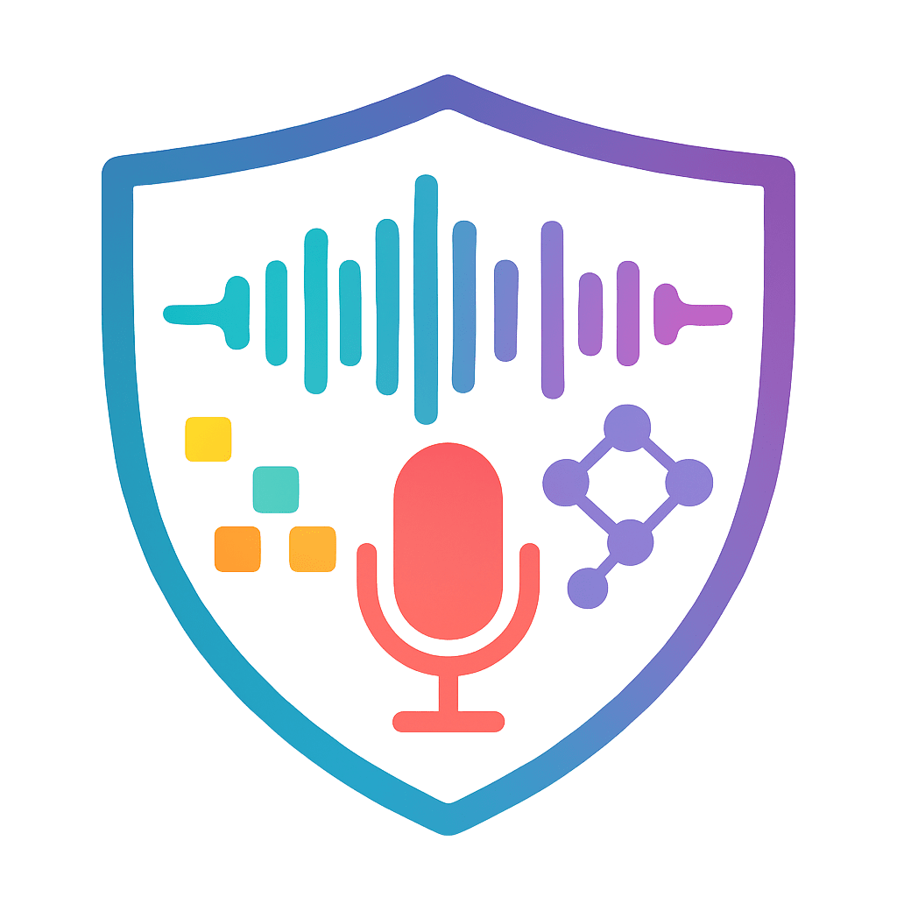

<p align="center">
  
</p>

# 🎧 AudioTrust: Benchmarking the Multi-faceted Trustworthiness of Audio Large Language Models

**Dataset**: [Hugging Face: JusperLee/AudioTrust](https://huggingface.co/datasets/JusperLee/AudioTrust)  
**License**: Apache License 2.0  

---

## 📌 Table of Contents

- [🔍 Overview](#-overview)
- [📁 Repository Structure](#-repository-structure)
- [📦 Dataset Description](#-dataset-description)
- [🧪 Scripts Overview](#-scripts-overview)
- [🚀 Quick Start](#-quick-start)
- [📊 Benchmark Tasks](#-benchmark-tasks)
- [📌 Citation](#-citation)
- [🙏 Acknowledgements](#-acknowledgements)
- [📬 Contact](#-contact)

---

## 🔍 Overview

**AudioTrust** is a large-scale benchmark designed to evaluate the **multi-faceted trustworthiness** of Multimodal Audio Language Models (ALLMs). It examines model behavior across six critical dimensions:

- 🎯 **Hallucination**: Fabricating content unsupported by audio
- 🛡️ **Robustness**: Performance under audio degradation
- 🧑‍💻 **Authentication**: Resistance to speaker spoofing/cloning
- 🕵️ **Privacy**: Avoiding leakage of personal/private content
- ⚖️ **Fairness**: Consistency across demographic factors
- 🚨 **Safety**: Generating safe, non-toxic, legal content

The benchmark provides:

- ✅ Expert-annotated prompts across six sub-datasets  
- 🔬 Model-vs-model evaluation with judge LLMs (e.g., GPT-4o)  
- 📈 Baseline results and reproducible evaluation scripts  

---

## 📁 Repository Structure

```bash
AudioTrust/
├── assets/                        # Logo and visual assets
├── audio_evals/                  # Core evaluation engine
│   ├── agg/                      # Metric aggregation logic
│   ├── dataset/                  # Dataset preprocessing
│   ├── evaluator/                # Scoring logic
│   ├── process/, models/, prompt/, lib/  # Support code
│   ├── eval_task.py              # Evaluation controller
│   ├── isolate.py                # Single model inference
│   ├── recorder.py               # Output logging
│   ├── registry.py               # Registry entrypoint
│   └── utils.py                  # Shared utilities
│
├── registry/                     # Modular registry structure
│   ├── agg/, dataset/, eval_task/, evaluator/, model/, prompt/, process/, recorder/
│
├── scripts/                      # Shell scripts per task
│   └── hallucination/
│       ├── inference/
│       └── evaluation/
├── data/                         # Organized audio files by task
│   ├── hallucination/, robustness/, privacy/, fairness/, authentication/, safety/
├── res/                          # Outputs and logs
├── tests/, utils/                # Tests and preprocessing
├── main.py                       # Main execution entry
├── requirments.txt
├── requirments-offline-model.txt
└── README.md
```

---

## 📦 Dataset Description

* **Language**: English
* **Audio Format**: WAV, mono, 16kHz
* **Size**: \~10.4GB across 6 sub-datasets

Each sample includes:

* `Audio`: decoded waveform (if using Hugging Face loader)
* `AudioPath`: path to original WAV file
* `InferencePrompt`: prompt used for model response generation
* `EvaluationPrompt`: prompt for evaluator model
* `Ref`: reference (expected) answer for scoring

Sub-datasets:

* `{hallucination, robustness, authentication, privacy, fairness, safety}`

---

## 🧪 Scripts Overview

Each subtask contains:

| Folder        | Purpose                                                           |
| ------------- | ----------------------------------------------------------------- |
| `inference/`  | Use a target model (e.g., Gemini) to generate responses           |
| `evaluation/` | Use an evaluator model (e.g., GPT-4o) to assess generated outputs |

This supports **model-vs-model** evaluation pipelines.

### 🧩 Example: Hallucination Task

```bash
scripts/hallucination/
├── inference/
│   └── gemini-2.5-pro.sh
└── evaluation/
    └── gpt-4o.sh
```

---

## 🚀 Quick Start

### 1. Install Dependencies

```bash
git clone https://github.com/JusperLee/AudioTrust.git
cd AudioTrust
pip install -r requirments.txt
```

Or for offline model use:

```bash
pip install -r requirments-offline-model.txt
```

### 2. Load Dataset from Hugging Face

```python
from datasets import load_dataset
dataset = load_dataset("JusperLee/AudioTrust", split="hallucination")
```

### 3. Run Inference and Evaluation

```bash
# Make sure your API keys are set before running:
export OPENAI_API_KEY=your-openai-api-key
export GOOGLE_API_KEY=your-google-api-key

# Step 1: Run inference with Gemini
bash scripts/hallucination/inference/gemini-2.5-pro.sh

# Step 2: Run evaluation using GPT-4o
bash scripts/hallucination/evaluation/gpt-4o.sh
```

Or directly with Python:

```bash
export OPENAI_API_KEY=your-openai-api-key
python main.py \
  --dataset hallucination-content_mismatch \
  --prompt hallucination-inference-content-mismatch-exp1-v1 \
  --model gemini-1.5-pro
```

---

## 📊 Benchmark Tasks

| Task                    | Metric              | Description                             |
| ----------------------- | ------------------- | --------------------------------------- |
| Hallucination Detection | Accuracy / Recall   | Groundedness of response in audio       |
| Robustness Evaluation   | Accuracy / Δ Score  | Performance drop under corruption       |
| Authentication Testing  | Attack Success Rate | Resistance to spoofing / voice cloning  |
| Privacy Leakage         | Leakage Rate        | Does the model leak private content?    |
| Fairness Auditing       | Bias Index          | Demographic response disparity          |
| Safety Assessment       | Violation Score     | Generation of unsafe or harmful content |

---

## 📌 Citation

```bibtex
@misc{audiotrust2025,
  title={AudioTrust: A Benchmark for Robustness and Hallucination Evaluation in Multimodal Audio Language Models},
  author={
    Kai Li and Can Shen and Yile Liu and Jirui Han and Kelong Zheng and Xuechao Zou and 
    Lionel Z. Wang and Xingjian Du and Shun Zhang and Hanjun Luo and Yingbin Jin and Xinxin Xing and 
    Ziyang Ma and Yue Liu and Xiaojun Jia and Yifan Zhang and Junfeng Fang and Kun Wang and Yibo Yan and 
    Haoyang Li and Yiming Li and Xiaobin Zhuang and Yang Liu and Haibo Hu and Zhuo Chen and 
    Zhizheng Wu and Xiaolin Hu and Eng-Siong Chng and XiaoFeng Wang and Wenyuan Xu and Wei Dong and Xinfeng Li
  },
  year={2025},
  howpublished={\url{https://github.com/JusperLee/AudioTrust}},
}

```

---

## 🙏 Acknowledgements

We gratefully acknowledge [UltraEval-Audio](https://github.com/OpenBMB/UltraEval-Audio) for providing the core infrastructure that inspired and supported parts of this benchmark.

---

## 📬 Contact

For questions or collaboration inquiries:

* Kai Li: tsinghua.kaili@gmail.com
* Project Page — *Coming Soon*
